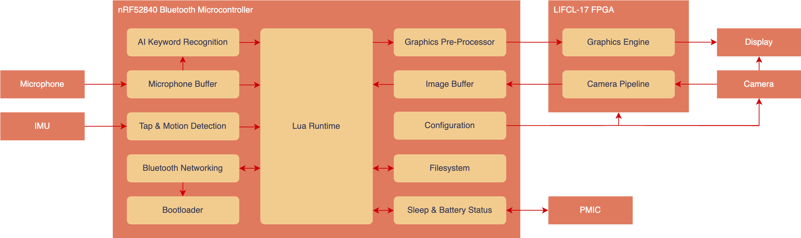

# Frame Firmware & RTL Codebase

Welcome to the complete codebase of the Frame hardware. For regular usage, check out the docs [here](https://docs.brilliant.xyz).

## System architecture

The codebase is split into three sections. The **nRF52 Application**, the **nRF52 Bootloader**, and the **FPGA RTL**. 

The nRF52 is designed to handle the overall system operation. It runs Lua, as well as handle Bluetooth networking, AI tasks and power management. The FPGA meanwhile, simply handles acceleration of the graphics and camera.



## Getting started with nRF52 firmware development

[](https://vscode.dev/redirect?url=vscode://ms-vscode-remote.remote-containers/cloneInVolume?url=https://github.com/with-context-engine/frame-codebase) 

1. Open this repository in a Dev Container (you will need Docker installed) and initialize any submodules by running the below from `./`:

    ```sh
    git submodule update --init --recursive
    ```

2. Run the following from `./`: 

    ```sh
    make release
    ```


### Debugging

1. Open the project in [VSCode](https://code.visualstudio.com).

    There are some build tasks already configured within `.vscode/tasks.json`. Access them by pressing `Ctrl-Shift-P` (`Cmd-Shift-P` on MacOS) → `Tasks: Run Task`.

    Try running the `Build` task. The project should build normally.

    You many need to unlock the device by using the `Erase` task before programming or debugging.

1. To enable IntelliSense, be sure to select the correct compiler from within VSCode. `Ctrl-Shift-P` (`Cmd-Shift-P` on MacOS) → `C/C++: Select IntelliSense Configuration` → `Use arm-none-eabi-gcc`.

1. Install the [Cortex-Debug](https://marketplace.visualstudio.com/items?itemName=marus25.cortex-debug) extension for VSCode in order to enable debugging.

1. A debugging launch is already configured within `.vscode/launch.json`. Run the `Application (J-Link)` launch configuration from the `Run and Debug` panel, or press `F5`. The project will automatically build and flash before launching.

1. To monitor the logs, run the task `RTT Console` and ensure the `Application (J-Link)` launch configuration is running.

## Getting started with FPGA development

For quickly getting up and running, the accelerators which run on the FPGA are already pre-built and bundled within this repo. If you wish to modify the FPGA RTL, you will need to rebuild the `fpga_application.h` file which contains the entire FPGA application.

1. Ensure you have the [Yosys](https://github.com/YosysHQ/yosys) installed.

1. Ensure you have the [Project Oxide](https://github.com/gatecat/prjoxide) installed.

1. Ensure you have the [nextpnr](https://github.com/YosysHQ/nextpnr) installed.

1. **MacOS users** can do the above three steps in one using [Homebrew](https://brew.sh).

    ```sh
    brew install --HEAD siliconwitchery/oss-fpga/nextpnr-nexus
    ```

1. You should now be able to rebuild the project by calling `make`:

    ```sh
    make fpga/fpga_application.h
    ```

To understand more around how the FPGA RTL works. Check the documentation [here](docs/fpga-architecture.md).