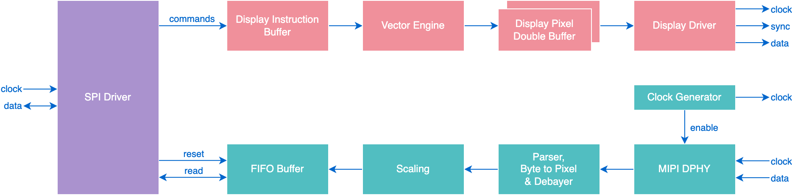

# Brilliant Frame FPGA

FPGA architecture for Frame.

## Architecture

## SPI Driver

### Registers

| Address | Function                   | Description | 
|:-------:|----------------------------|-------------|
| 0x00    | GET_CHIP_ID                | Returns the chip ID value. **Read: <0xAA>**
| 0x01    | GET_BINARY_VERSION         | Returns the build date as a 12 character string. **Read: "v23.124.1300"**
| 0x10    | GRAPHICS_ASSIGN_COLOR      | Assigns a color to one of the 16 color palette slots. Color should be provided as a 24bit value, but will be internally converted to RGB565 16bit format. **Write: <palette-index[7:0]>** **Write: <color[23:0]>**
| 0x11    | GRAPHICS_MOVE_PEN          | Moves the drawing pen to a specified absolute co-ordinate. **Write: <x-pos[15:0]>** **Write: <y-pos[15:0]>**
| 0x12    | GRAPHICS_MOVE_PEN_FAST     | Moves the drawing pen from the current pen position. **Write: <x-distance[7:0]>** **Write: <y-distance[7:0]>**
| 0x13    | GRAPHICS_DRAW_LINE         | Draws a straight line from the current pen position. **Write: <x-distance[15:0]>** **Write: <y-distance[15:0]>**
| 0x14    | GRAPHICS_DRAW_CURVE        | *TBD*
| 0x15    | GRAPHICS_CLOSE_AND_FILL    | Draws a line back to the pen starting point, and fills the shape with the currently set pen color.
| 0x16    | GRAPHICS_DRAW_PIXELS_FAST  | Draws a number of pixels incrementing along the x direction from the current pen position. **Write: <pixels[7:0]>**
| 0x17    | GRAPHICS_SET_PEN_THICKNESS | Sets the thickness of the pen in pixels. **Write: <thickness[8:0]>**
| 0x18    | GRAPHICS_SET_PEN_COLOR     | Sets the pen color to one of the colors held in the 16 color palette. **Write: <palette-index[7:0]>**
| 0x19    | GRAPHICS_SHOW              | Executes all buffered display commands and prints to the display.
| 0x20    | CAMERA_CAPTURE             | Resets the FIFO and starts a fresh image capture.
| 0x21    | CAMERA_READ_FIFO           | Reads a number of bytes from the FIFO. **Read: <bytes-available[23:0]>** **Read: <data[...]>**
| 0x23    | CAMERA_CROP                | Sets the crop limits for the camera's captured image. **Write: <left-crop[15:0]>** **Write: <right-crop[15:0]>** **Write: <top-crop[15:0]>** **Write: <bottom-crop[15:0]>**
| 0x24    | CAMERA_COMPRESSION_FACTOR  | Sets the compression factor for the JPEG encoder. **Write: <factor[7:0]>**

## Graphics Pipeline

### Vector Printing

### Fast Printing of Raster Images

## Licence

Copyright © 2023 Brilliant Labs Limited

Licensed under CERN Open Hardware Licence Version 2 - Permissive
