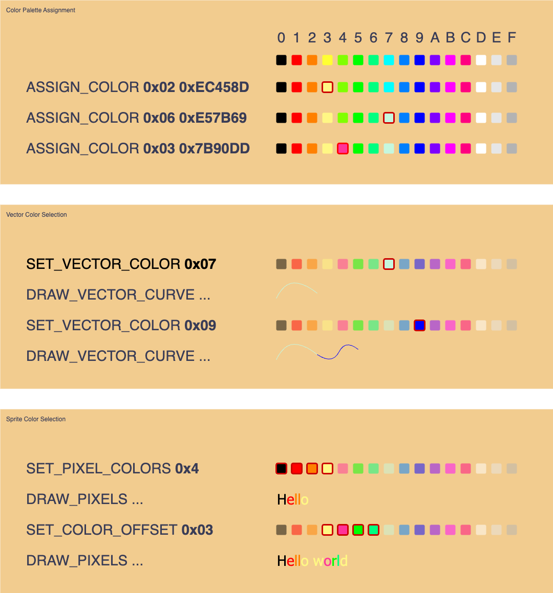
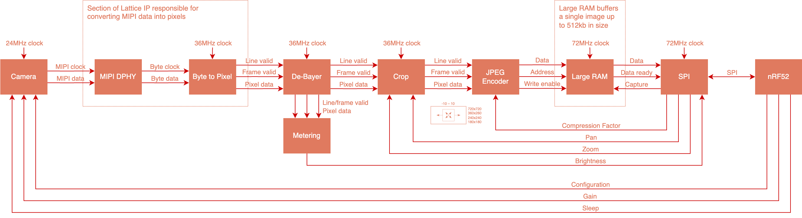

# Brilliant Frame FPGA

The Frame FPGA architecture consists of three major components. The SPI driver, the graphics pipeline and the camera pipeline.

## Architecture

## SPI Driver

The SPI driver interfaces the FPGA with the nRF52. The FPGA is fully driven over SPI and provides access to the graphics and camera pipelines.

### Registers

Each function is accessed through a register. Registers are always addressed by one byte, followed by a various number of read or write bytes based on the operation.

| Address | Function                | Description | 
|:-------:|-------------------------|-------------|
| 0x11    | `GRAPHICS_ASSIGN_COLOR` | Assigns a color to one of the 16 color palette slots. Color should be provided in YCbCr format. **Write: `palette_index[7:0]`** **Write: `y[7:0]`** **Write: `cb[7:0]`** **Write: `cr[7:0]`**
| 0x12    | `GRAPHICS_DRAW_SPRITE`  | Draws a sprite on the screen. The first two arguments specify an absolute x and y position to print the sprite. The sprite will be printed from its top left corner. The third argument determines the width of the sprite in pixels. The fourth argument determines the number of colors contained in the sprite. This value may be 2, 4, or 16. The final argument specifies the color palette offset for assigning the color values held in the sprite against the stored colors in the palette. Following bytes will then be printed on the background frame buffer. **Write: `x_position[15:0]`** **Write: `y_position[15:0]`** **Write: `width[15:0]`** **Write: `total_colors[7:0]`** **Write: `palette_offset[7:0]`** **Write: `pixel_data[7:0]`** **...** **Write: `pixel_data[7:0]`** 
| 0x13    | `GRAPHICS_DRAW_VECTOR`  | Draws a cubic Bézier curve from the start position to the end position. Control points 1 and 2 are relative to the start and end positions respectively, and are used to determine the shape of the curve. The final argument determines the color used from the current palette, and can be between 0 and 15. **Write: `x_start_position[15:0]`** **Write: `y_start_position[15:0]`** **Write: `x_end_position[15:0]`** **Write: `y_end_position[15:0]`** **Write: `ctrl_1_x_position[15:0]`** **Write: `ctrl_1_y_position[15:0]`** **Write: `ctrl_2_x_position[15:0]`** **Write: `ctrl_2_y_position[15:0]`** **Write: `color[7:0]`**
| 0x14    | `GRAPHICS_BUFFER_SHOW`  | The foreground and background buffers are switched. The new foreground buffer is continuously rendered to the display, and the background buffer can be used to load new draw commands.
| 0x20    | `CAMERA_CAPTURE`        | Starts a new image capture.
| 0x21    | `CAMERA_BYTES_AVAILABLE`| Returns how many bytes are available to read within the capture memory. **Read: `bytes_available[23:0]`**
| 0x22    | `CAMERA_READ_BYTES`     | Reads a number of bytes from the capture memory. **Read: `data[7:0]`** **...** **Read: `data[7:0]`**
| 0x23    | `CAMERA_ZOOM`           | Sets the zoom factor. A setting of `1` captures a 720x720 image, `2` captures 360x360, `3` captures 240x240, and `4` captures 180x180. **Write: `zoom_factor[7:0]`**
| 0x24    | `CAMERA_PAN`            | Pans the capture window up or down in discrete steps. A setting of `10` captures the top-most part of the image, `0` is the middle, and `-10` is the bottom-most **Write: `pan_position[7:0]`**
| 0x25    | `CAMERA_READ_METERING`  | Returns the current brightness levels for the red, green and blue channels of the camera. Two sets of values are returned representing spot and average metering. **Read: `center_red_level[7:0]`** **Read: `center_green_level[7:0]`** **Read: `center_blue_level[7:0]`** **Read: `average_red_level[7:0]`** **Read: `average_green_level[7:0]`** **Read: `average_blue_level[7:0]`**
| 0x26    | `COMPRESSION_QUALITY_FACTOR` | Sets the Quality Factor (QF) of the saved JPEG image. High values are higher quality but bigger size. **Write: `quality_factor[1:0]`** **Bits [1:0]**: `0x01`: QF = 100 `0x00`: QF = 50  `0x11`: QF = 25 `0x10`: QF = 10 **Default:** `0x00`, QF = 50
| 0x28    | `DPHY_POWER_DOWN` | When set, enables power-down mode of the MIPI D-PHY. **Write: `dphy_power_down[0]`** **Bit 0**: `0x0`: Normal operation `0x1`: Enable power-down mode **Default:** `0x1`, D-PHY is powered down per default
| 0x30    | `COMPRESSION_STATUS`        | Status of JPEG core. **Read: `image_complete[0]`**   **Bit 0**: Returns 1 when compression completed. It is recommended to read a 1 twice before proceeding.
| 0x31    | `COMPRESSED_BYTES`  | Returns size in bytes of the ECS (= Entropy Coded Segment, that is, everything after the SOS marker and header, and before the EOS marker in the JPEG file).  **Read: `compressed_bytes[15:0] (LSB first)`**
| 0x32    | `GAMMA_BYPASS` | When set, disables gamma correction. **Write: `gamma_bypass[0]`** **Bit 0**: `0x0`: Normal operation `0x1`: Gamma correction disabled **Default:** `0x0`, gamma correction operates normally per default
| 0x40    | `PLL_CONTROL` | PLL Control Register. Controls PLL power and clock mux of image buffer.  **Write: `{reserved[7:2], image_buffer_clock_sel[1], pll_powerdown_n[0]}`**  **Bit 0**: `0x0`: PLL powered down `0x1`: Normal PLL operation **Default:** `0x0`, PLL is powered down per default  **Bit 1**: `0x0`: Image buffer is clocked by PLL-generated pixel clock `0x1`: Image buffer is clocked by SPI clock **Default:** `0x0`, image buffer is clocked by PLL    **Bits [7:2]**: Must be set to 0x0
| 0x41    | `PLL_STATUS`        | Status of PLL. **Read: `pll_locked[0]`**   **Bit 0**: Returns 1 when PLL is in locked state. It is recommended to read a 1 twice before proceeding.
| 0xDB    | `GET_CHIP_ID`           | Returns the chip ID value. **Read: `0x81`**

## Graphics

The graphics pipeline consists of 4 sub-components. The sprite engine, the vector engine, the frame buffers and the output driver.

Two types of graphics may be drawn. Sprites, such as text, or vectors such as lines or curves. Both types of graphics may be drawn on the screen at the same time.

### 16 Color Palette

The display connected to Frame is a 640x400 color display. With a color depth of 4 bits per pixel (i.e. 16 colors), four of the five 512kb on chip RAM blocks can be used to create two frame buffers. While one frame buffer is being rendered onto the display, the other is used to assemble graphics. Once this buffer is ready, they are swapped.

Rather than limiting the graphics to 16 fixed colors, each color index is mapped to a user configurable 10bit YCbCr color value.

The color at index 0, is always expected to be the transparent (black) background color. This can be overridden if a transparent background isn't needed.

### Sprite Graphics

Bitmap sprites can be drawn using the `GRAPHICS_DRAW_SPRITE` command.

Sprites can be position anywhere on the screen and will render from the top left corner of the sprite origin. The `width` parameter determines how many pixels the sprite engine will print on a line before automatically returning to the first column, one row of pixels down.

Sprite data can be in one of three color formats. 1bit color, 2bit color and 4bit color. Each format allows for 2, 4 and 16 colors respectively, including the transparent (black) background color. The benefit of the lower color formats is that more pixels can be included per byte of transfer to the FPGA. This allows for faster rendering and a reduced storage requirement on the nRF52 main processor. 

When printing a single sprite, the `palette_offset` parameter can be provided to shift which colors are used. This allows for a 1bit font sprite to take on a different color from anywhere in the palette. This option can be changed on a sprite by sprite basis.

### Vector Graphics

Vectors can be drawn with the `GRAPHICS_DRAW_VECTOR` command. By setting the control points to 0, straight lines can also be drawn.

## Camera

The complete pipeline for the camera subsystem is as follows:

And the JPEG encoding subsystem is further broken down as follows:

### Capturing Images

TODO

## Licence

Copyright © 2023 Brilliant Labs Limited

Licensed under CERN Open Hardware Licence Version 2 - Permissive
