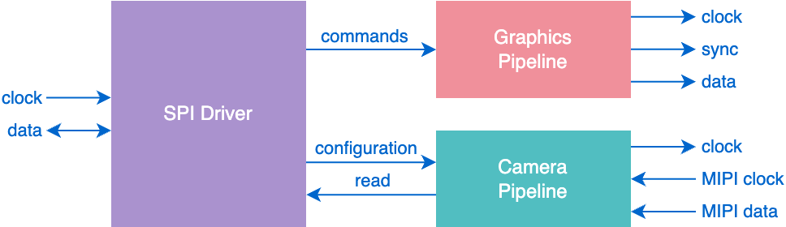
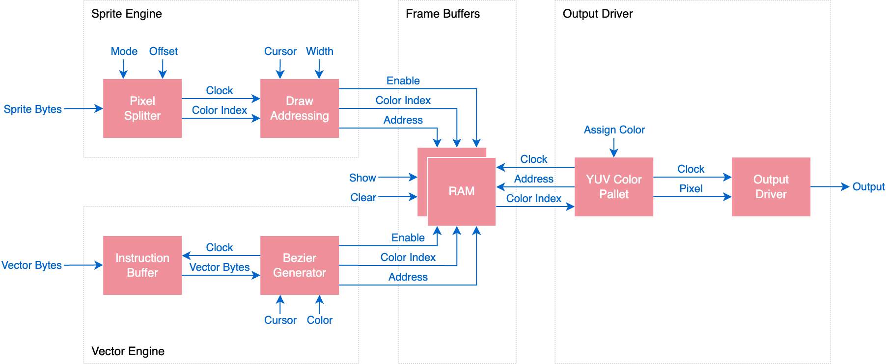
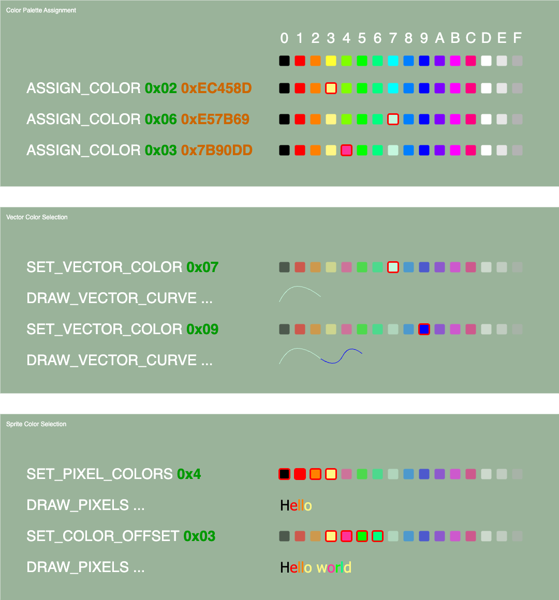
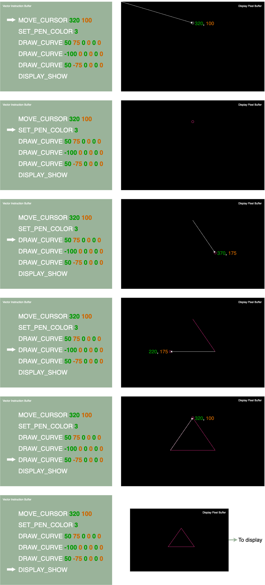
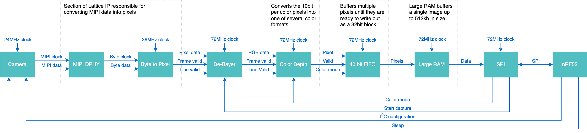

# Brilliant Frame FPGA

The Frame FPGA architecture consists of three major components. The SPI driver, the graphics pipeline and the camera pipeline.

## Architecture

## SPI Driver

The SPI driver interfaces the FPGA with the nRF52. The FPGA is fully driven over SPI and provides access to the graphics and camera pipelines.

### Registers

Each function is accessed through a register. Registers are always addressed by one byte, followed by a various number of read or write bytes based on the operation.

| Address | Function                        | Description | 
|:-------:|---------------------------------|-------------|
| 0x10    | GRAPHICS_CLEAR                  | Clears the background frame buffer.
| 0x11    | GRAPHICS_ASSIGN_COLOR           | Assigns a color to one of the 16 color palette slots. Color should be provided in YCbCr format. **Write: <palette-index[7:0]>** **Write: <y[7:0]>** **Write: <cb[7:0]>** **Write: <cr[7:0]>**
| 0x12    | GRAPHICS_DRAW_SPRITE            | Draws a sprite on the screen. The first two arguments specify an absolute x and y position to print the sprite. The sprite will be printed from its top left corner. The third argument determines the width of the sprite in pixels. The fourth argument determines the number of colors contained in the sprite. This value may be 1, 4, or 16. The final argument specifies the color pallet offset for assigning the color values held in the sprite against the stored colors in the pallet. Following bytes will then be printed on the background frame buffer. **Write: <x-position[15:0]>** **Write: <y-position[15:0]>** **Write: <sprite-width[15:0]>** **Write: <total-colors[7:0]>** **Write: <pallet-offset[7:0]>** **Write: <pixel-data[7:0]>** **...** **Write: <pixel-data[7:0]>** 
| 0x13    | GRAPHICS_DRAW_VECTOR_CURVE      | Draws a cubic Bézier curve from the start position to the end position. Control points 1 and 2 are relative to the start and end positions respectively, and are used to determine the shape of the curve. The final argument determines the color used from the current pallet, and can be between 0 and 15. **Write: <x-start-position[15:0]>** **Write: <y-start-position[15:0]>** **Write: <x-end-position[15:0]>** **Write: <y-end-position[15:0]>** **Write: <ctrl-1-x-position[15:0]>** **Write: <ctrl-1-y-position[15:0]>** **Write: <ctrl-2-x-position[15:0]>** **Write: <ctrl-2-y-position[15:0]>** **Write: <color[7:0]>**
| 0x14    | GRAPHICS_BUFFER_SHOW            | The foreground and background buffers are switched. The new foreground buffer is continuously rendered to the display, and the background buffer can be used to load new draw commands.
| 0x20    | CAMERA_CAPTURE                  | Starts a new image capture.
| 0x21    | CAMERA_BYTES_AVAILABLE          | Returns how many bytes are available in the capture memory. Returns -1 once all bytes have been read for the current capture, or no capture has been started **Read: <bytes-available[23:0]**
| 0x22    | CAMERA_READ_BYTES               | Reads a number of bytes from the capture memory. **Read: <data[...]>**
| 0xDB    | GET_CHIP_ID                     | Returns the chip ID value. **Read: <0x81>**

## Graphics

The graphics pipeline consists of 4 sub-components. The sprite engine, the vector engine, the frame buffers and the output driver.

Two types of graphics may be drawn. Sprites, such as text, or vectors such as lines or curves. Both types of graphics may be drawn on the screen at the same time.

### 16 Color Pallet

The display connected to Frame is a 640x400 color display. With a color depth of 4 bits per pixel (i.e. 16 colors), four of the five 512kb on chip RAM blocks can be used to create two frame buffers. While one frame buffer is being rendered onto the display, the other is used to assemble graphics. Once this buffer is ready, they are swapped.

Rather than limiting the graphics to 16 fixed colors, each color index is mapped to a user configurable 10bit YCbCr color value.

For vectors, any of the 16 colors may be selected, however For sprites, the colors may be limited to 1, 2 or 4 colors based on the currently set pixel color mode. A pallet offset can however be used to shift which group of colors are used per drawing. This allows for multiple color fonts for example.

### Pixel Printing

TODO

### Vector Printing

Vectors can be drawn with the DRAW_CURVE command. By setting the control points to 0, straight lines can also be drawn.

## Camera

The complete pipeline for the camera subsection is as follows:

### Capturing Images

TODO

## Licence

Copyright © 2023 Brilliant Labs Limited

Licensed under CERN Open Hardware Licence Version 2 - Permissive
